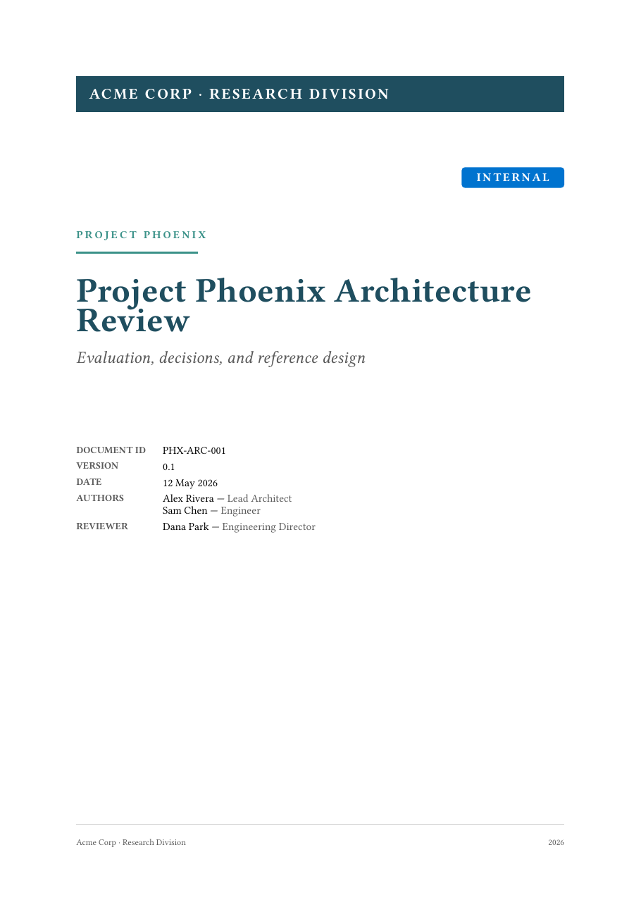

# truss-report

A structured technical report template for Typst. Designed for engineering and
research documents that need to combine long-form prose with **requirement
blocks**, **Architecture Decision Records**, **trade-off matrices**, and
**callouts** — the structural elements technical reports rest on.



## Quick start

In the Typst web app, choose `truss-report` from "Start from template", or
locally:

```bash
typst init @preview/truss-report:0.1.0
typst compile main.typ
```

A starter `main.typ` is created showing every helper in context.

## Usage

```typst
#import "@preview/truss-report:0.1.0": *

#show: truss-report.with(
  title: "Project Phoenix Architecture Review",
  subtitle: "Evaluation, decisions, and reference design",
  doc-id: "PHX-ARC-001",
  version: "0.1",
  date: datetime(year: 2026, month: 5, day: 12),
  authors: ((name: "Alex Rivera", role: "Lead Architect"),),
  reviewers: ((name: "Dana Park", role: "Director"),),
  organisation: "Acme Corp",
  project: "Project Phoenix",
  confidentiality: "internal",
  abstract: [Short executive summary...],
)

= Section 1
Body content...
```

## Document arguments

| Argument                  | Type       | Default         | Notes |
|--------------------------|------------|----------------|-------|
| `title`                   | string     | required        | Cover title and running header. |
| `subtitle`                | string     | none            | Italic line under the title. |
| `doc-id`                  | string     | none            | Free-form identifier (e.g. `PHX-ARC-001`). |
| `version`                 | string     | `"0.1"`         | Shown on cover and header. |
| `date`                    | datetime   | today           | Cover date. |
| `authors`                 | array      | `()`            | Each entry: `(name:, role:, email:)`. `role` and `email` optional. |
| `reviewers`               | array      | `()`            | Same shape as `authors`. |
| `organisation`            | string     | none            | Top banner on cover, left footer running. |
| `project`                 | string     | none            | Accent tag above title, right footer running. |
| `confidentiality`         | string     | `"draft"`       | Key into `confidentiality-levels`. |
| `confidentiality-levels`  | dictionary | built-in        | Override to add custom levels. |
| `abstract`                | content    | none            | Executive-summary block on page 2. |
| `history`                 | array      | `()`            | Revision history table; entries `(version:, date:, changes:, author:)`. |
| `theme`                   | dictionary | `(:)`           | Partial overrides for the default theme (see below). |
| `paper`                   | string     | `"a4"`          | Any Typst paper size. |
| `margin`                  | dictionary | `(top: 3.2cm, bottom: 2.5cm, left: 2.2cm, right: 2.2cm)` | Page margins. |

## Helpers

### `callout(kind, title, body)`

Accent-bar information block. Six kinds: `note`, `decision`, `warning`,
`risk`, `todo`, `insight`.

```typst
#callout(kind: "warning", title: "Out of scope")[
  This document does not cover roll-out planning.
]
```

### `req(id, title, priority, ...) [body]`

Structured requirement block. Pass `category-color` to color-code by your
own taxonomy — the id is shown verbatim, so any naming convention works
(`REQ-001`, `FUN-12`, `CISC-7.1`, etc.).

| Argument          | Notes |
|------------------|-------|
| `id`              | Required. Shown as a monospace badge. |
| `title`           | Required. Bold title next to the badge. |
| `priority`        | `MUST` / `SHOULD` / `MAY`. Colored badge on the right. |
| `category-color`  | `rgb("#…")` for the left accent bar. Defaults to theme primary. |
| `rationale`       | Optional. Why this requirement exists. |
| `verification`    | Optional. How compliance is checked. |
| `source`          | Optional. Where it comes from (standard, stakeholder, etc.). |
| body              | The requirement statement itself. |

```typst
#req(
  id: "FUN-001",
  title: "Standards compliance",
  priority: "MUST",
  category-color: rgb("#0073CF"),
  rationale: [Interoperability with all current consumers.],
  verification: "Inspection against the published specification.",
  source: "Consumer projects.",
)[
  The system #strong[shall] produce outputs compliant with X.
]
```

### `adr(id, title, status, date, ctx, decision, consequences)`

Lightweight Architecture Decision Record. Status one of `Proposed`,
`Accepted`, `Deprecated`, `Superseded`.

> **Note:** the parameter is `ctx:`, not `context:` — `context` is a reserved
> Typst keyword and cannot be used as a parameter name.

```typst
#adr(
  id: "ADR-001",
  title: "Adopt Option B as reference design",
  status: "Proposed",
  date: datetime(year: 2026, month: 5, day: 12),
  ctx: [Option B scored highest on the weighted matrix...],
  decision: [Option B becomes the reference design...],
  consequences: [Team must invest in operator training...],
)
```

### `landscape(body)`

Wraps content in a flipped-orientation page. Use it for wide matrices and
diagrams.

> Inside `landscape[ … ]`, use level-2 (`==`) or a styled `text(...)` block
> for the title. Level-1 (`=`) headings insert a portrait pagebreak.

```typst
#landscape[
  #text(size: 18pt, fill: rgb("#1F4E5F"), weight: "bold")[Scoring summary]
  #table( … )
]
```

### `score(value, max: 5)`

Color-coded score cell for trade-off matrices. Green for high values, red
for low. Use inside `table` cells.

```typst
score(4)  // green-ish
score(2)  // orange
```

### `kv-block(title, (key, value), …)`

Compact key/value summary, useful for environment specifications.

```typst
#kv-block(
  title: "Target environment",
  ("Platform", "Linux containers on Kubernetes"),
  ("Storage",  "Object store + relational database"),
)
```

## Theming

Override the default theme by passing a partial dictionary:

```typst
#show: truss-report.with(
  title: "...",
  theme: (
    primary: rgb("#1A237E"),    // navy
    accent:  rgb("#3949AB"),    // lighter navy
    font-body: ("Source Sans 3",),
    font-sans: ("Source Sans 3",),
  ),
)
```

The full theme keys:

| Key            | Default                                | Used for |
|---------------|---------------------------------------|----------|
| `primary`      | `#1F4E5F` (deep teal)                  | Headings, banner, accents. |
| `accent`       | `#3A9188` (bright teal)                | Links, section markers, project tag. |
| `muted`        | `#5A5A5A`                              | Secondary text. |
| `rule`         | `#C8C8C8`                              | Horizontal rules, table borders. |
| `code-bg`      | `#F4F4F6`                              | Inline / block code background. |
| `block-bg`     | `#FAFAFC`                              | Requirement / abstract / kv-block fill. |
| `semantic`     | (info / success / warn / danger / purple / cyan) | Callouts and priority badges. |
| `font-body`    | Libertinus Serif fallback chain        | Body text. |
| `font-sans`    | Libertinus Sans fallback chain         | Headings, badges. |
| `font-mono`    | DejaVu Sans Mono fallback chain        | Code, IDs. |
| `font-size`    | `10.5pt`                               | Body size. |
| `line-height`  | `0.65em`                               | Paragraph leading. |

## Custom confidentiality levels

Pass your own dictionary if the built-in five levels (`draft`, `public`,
`internal`, `restricted`, `confidential`) don't fit:

```typst
#show: truss-report.with(
  title: "...",
  confidentiality: "tlp-amber",
  confidentiality-levels: (
    "tlp-white":  (label: "TLP:WHITE",  color: rgb("#FFFFFF")),
    "tlp-green":  (label: "TLP:GREEN",  color: rgb("#2E7D32")),
    "tlp-amber":  (label: "TLP:AMBER",  color: rgb("#E65100")),
    "tlp-red":    (label: "TLP:RED",    color: rgb("#C62828")),
  ),
)
```
## Contributing

Issues and pull requests welcome at
[github.com/CyberMer/truss-report](https://github.com/CyberMer/truss-report).
